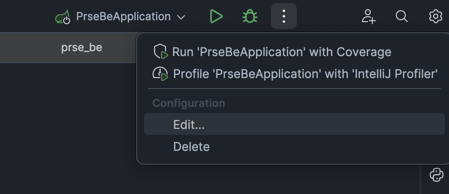
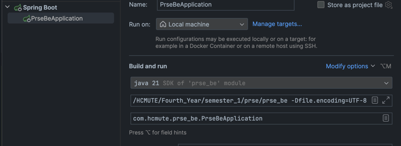
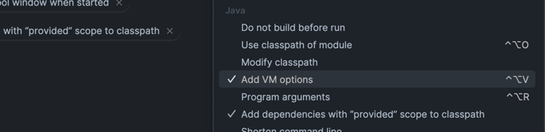

# Project On Software Engineering

<........>

## Table of Contents
1. [Setup](#setup)
2. [Usage](#usage)
3. [Contributing](#contributing)
4. [License](#license)

## Setup

### Prerequisites
- [Java Development Kit (JDK)](https://www.oracle.com/java/technologies/javase-downloads.html) ( version 21 )
- [Apache Maven](https://maven.apache.org/) (version 4.0 )

### Installation
1. Clone the repository
2. Open project with IntelliJ, then click Edit like the guild image below.


3. Then choose "Modify options".

4. Then choose "Add VM options".

5. Then add the following VM options:
```shell
-Dapppath=<your_path>/prse_be
-Dfile.encoding=UTF-8 
```